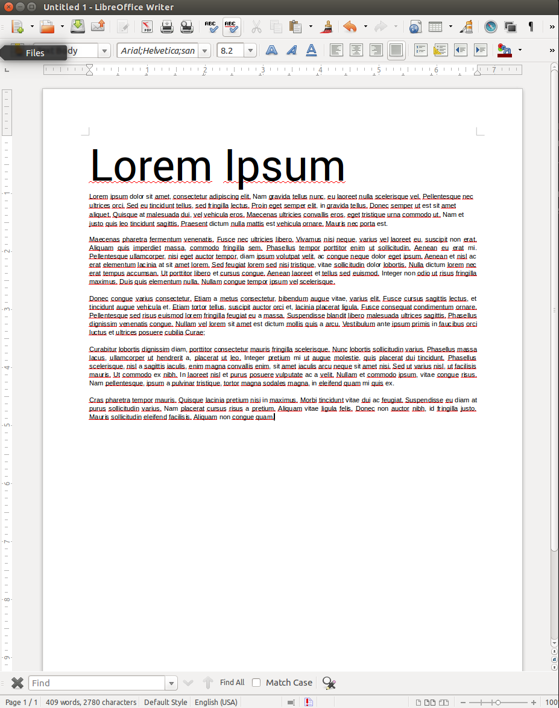

A few days ago I talked with [Hastebrot](http://hastebrot.github.io/) about
user interfaces and we tried to figure out why some applications are more 
popular than other, even though they aren't always the best application.

### Word processing vs. LaTeX

One of the most prominent example is the choice between a WYSIWYG Word Processor 
and LaTeX. Without any background one would almost certainly choose Word over 
LaTeX. This becomes very clear when comparing the editors for both text 
processing programs.

The left picture shows a LaTeX document with a tree structure containing all
associated files. The right picture shows a document in LibreOffice Writer.

There are lots of arguments for either one. If I ask people why they use
a WYSIWYG tool over Latex most of them answer: "It is faster" / 
"I see immediately what I do". Wheres many people who use Latex say, that it
produces qualitatively better results.

I don't want to go into this discussion, but I want to point out a very important
difference between those tools. The word processing tool offers an interface in
which the user can do everything he wants and there will always be a resulting
document. The user sees what she does, there is no way to modify the document that
creates an invalid document. It is not always easy to achieve what is intended
but there is no invalid document.

On the other hand there is LaTeX with a system that is utterly unforgiving. Only
a minor mistake can ruin your document. And by *ruin* I don't mean misplaced 
figures (although that can be very annoying too), I mean compilation errors that
aren't very expressive. And even if they were always simple to understand it is
possible to create invalid documents.

### Why compilation errors are bad?

In my opinion, a natural approach to solve problems is exploring the problem.
 - People like to solve creative tasks.
 - People like experimenting.
 - People like interactivity. 

I often see people stare at screens if someone tries to solve a visual problem.
I don't recall anyone staring at a screen with joy trying to solve some syntax error.

### Nothing is incorrect!

Hastebrot and I thought of a paradigm that tries to capture our ideas in a short 
expressive way. Our first thought was *Everything is correct* but we soon realized
that this would give a wrong impression of what the paradigm should express.

Our **Nothing is incorrect** paradigm states that every program that enables you
to create something should:
1. **accept every** reasonable user **input**
1. **not interrupt** your workflow!
1. **display** at least a preview of the **results interactively**

This paradigm leads to an instant gratification solution.

In my previous example the word processing implements a **Noting is incorrect**
paradigm leading to a richer experience. LaTeX fails to implement a single point
in the above definition unless you use Lyx.

### Examples

We found lots of other examples where the **Nothing is incorrect** paradigm seems
to have an impact on the design of certain languages. For example consider HTML5
and XHTML. XHTML has a well defined structure and forced the user to create 
valid XML like Markup code. Whereas HTML5 is permissive and parses nearly
everything. Even though sticking to a well defined standard is especially important
for the web, HTML5 is surely the predominant format in the web.

Another rather new language that became well known in the last years is Markdown.
It fulfills the first two criteria and with additional tools the third one
is also possible.
